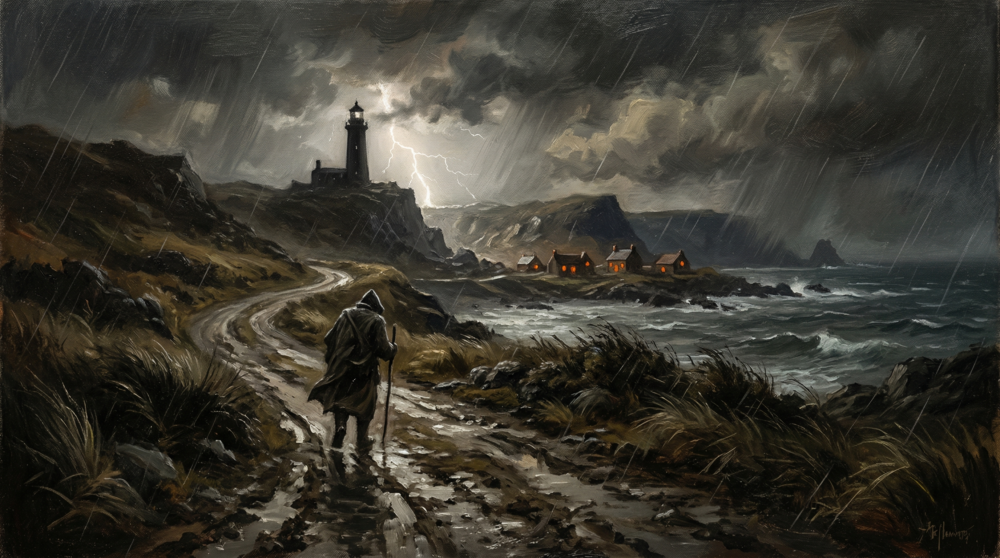

# crawledcode — D&D 5e Campaign Engine for Claude Code

A complete D&D 5th Edition campaign engine that turns Claude Code into an expert Dungeon Master. The entire game state lives on disk as a navigable directory tree — rules, characters, world state, NPCs, quests, combat, and narrative are all tracked in structured markdown files.

## How It Works

Claude Code reads `CLAUDE.md` files at every directory level for context, uses bash for dice rolling, spawns NPC subagents for rich character interactions, and persists all game state to disk so campaigns can be saved and resumed across sessions.

## Quick Start

```
/session new my-campaign
```

Or just tell the DM what you want:

```
Alright, DM! Let's play a nice, contained one shot DnD scenario. It should be rich
and interesting. I'll be your player. You can work on scenario planning while you help
me with character creation. Dealer's choice in all other elements! Let's go :)
```

That's the exact prompt that produced [The Vanishing Tide](#the-vanishing-tide-one-shot) — a complete mystery/horror one-shot with four acts, six NPCs, a morally complex antagonist, and a branching finale with four possible endings. No setup required beyond cloning the repo and opening Claude Code.

## How to Play

This is a role-playing game, not a video game. There's no winning — there's a world that responds to what you do in it.

**Talk to people.** The NPCs have personalities, secrets, and agendas. Ask questions. Listen to what they say and what they don't say. Buy someone a drink. Fix their broken railing. The best information comes from trust, not dice rolls.

**Describe what you do, not what you want to happen.** Say "I press my ear to the door and listen" instead of "I roll Perception." Say "I tell Brine about the claw marks and ask if he's seen anything like them" instead of "I persuade Brine." The DM will call for rolls when the mechanics matter.

**Explore.** Poke at things that seem odd. Read the notice board. Check the graveyard. Look at what's under the floorboards. The world is full of details that reward curiosity.

**Make choices that feel right for your character**, not choices that are mechanically optimal. A halfling ranger with a flaw about never getting attached might still sprint into a sea cave for a stranger's daughter — and that's the interesting part.

**Fail forward.** Bad rolls don't mean dead ends. A botched Investigation might mean you miss a journal but find something else. The story keeps moving. The DM doesn't let a single die roll stop the narrative — and neither should you.

**Combat is one option, not the default.** You can fight the monster. You can also talk to her. You can also find out why she's weeping and whether she used to be someone the village loved. Some of the best sessions end with zero arrows fired.

## Directory Structure

```
crawledcode/
├── CLAUDE.md                    Master DM instructions
├── .claude/
│   ├── settings.json            Hooks + agent teams config
│   ├── agents/                  NPC subagent + world-tick agent definitions
│   │   └── world-tick.md        Background world simulation agent
│   └── skills/                  7 custom slash commands
│       ├── roll.md              /roll — dice rolling engine
│       ├── combat.md            /combat — combat encounter management
│       ├── rest.md              /rest — short/long rest processing
│       ├── levelup.md           /levelup — guided character advancement
│       ├── shop.md              /shop — merchant interaction
│       ├── session.md           /session — campaign lifecycle management
│       └── world-tick.md        /world-tick — background world advancement
│
├── rules/                       D&D 5e SRD 5.1 reference (READ ONLY)
│   ├── 00-quick-reference.md    DM screen: DCs, conditions, actions
│   ├── core/                    7 files — ability scores, skills, combat, conditions, etc.
│   ├── classes/                 13 files — all 12 classes + multiclassing
│   ├── races/                   All 9 SRD races
│   ├── backgrounds/             Acolyte + background system
│   ├── feats/                   Grappler + feat system
│   ├── equipment/               5 files — weapons, armor, gear, mounts, economy
│   ├── spellcasting/            3 files + spells/ — casting rules + indices
│   │   └── spells/              10 files — all 361 SRD spells by level
│   ├── monsters/                8 files — 300+ stat blocks organized by CR
│   ├── treasure/                3 files — 250+ magic items, treasure tables
│   ├── running-the-game/        5 files — encounter building, XP, traps, etc.
│   └── feats/                   Grappler (only SRD feat)
│
├── games/                       Campaign data (one subdirectory per campaign)
│
├── agents/                      NPC agent system
│   └── templates/               8 files — info wall protocol + 7 archetype templates
│                                (quest-giver, merchant, companion, villain,
│                                 authority, sage, trickster)
│
└── hooks/                       Atmospheric trigger scripts
    ├── post-write.sh            Dispatcher for Write tool events
    ├── post-edit.sh             Dispatcher for Edit tool events
    ├── post-bash.sh             Dispatcher for Bash tool events
    ├── dice-fanfare.sh          Natural 20/1 banners + sound
    ├── combat-start.sh          "ROLL INITIATIVE" banner + sound
    ├── auto-save.sh             Session state save indicator
    ├── hp-warning.sh            HP threshold alerts
    └── location-change.sh       Terminal title updates
```

## Available Skills

| Command | Description |
|---------|-------------|
| `/roll` | Roll dice — XdY+Z, advantage, disadvantage, checks, saves, attacks |
| `/combat` | Enter, manage, and end combat encounters with initiative and ASCII maps |
| `/rest` | Process short or long rests with hit dice, HP, and feature recharges |
| `/levelup` | Walk through leveling up a character step by step |
| `/shop` | Browse merchant inventory, buy, sell, and haggle |
| `/session` | Start, save, resume, or create campaigns |
| `/world-tick` | Advance the world in the background — NPC agendas, factions, weather |

## Rules Coverage

All content sourced from the **D&D 5e SRD 5.1** (Creative Commons Attribution 4.0 International by Wizards of the Coast):

- **88 reference files** totaling ~1 MB of game content
- **12 classes** with complete features levels 1-20 and SRD subclasses
- **9 races** with full racial traits
- **361 spells** with complete mechanical descriptions
- **300+ monsters** with full stat blocks (CR 0 through CR 30)
- **250+ magic items** across all rarity tiers
- **Complete equipment tables**, encounter building rules, treasure generation, and more

## NPC Agent System — Information Walls

Significant NPCs are implemented as Claude Code subagents with **information walls** — each NPC is spawned as a separate agent that genuinely does not have access to the full game state. This creates real information asymmetry:

- Each NPC has a **whitelist** of files they can read (their own profile, their location, the calendar) and a **blacklist** of files they must never access (player character sheets, DM secrets, other NPCs' private thoughts)
- The NPC's words and decisions come from an independent generation with restricted context — they can withhold, reveal, or accidentally leak information based on their own judgment
- The DM maintains full omniscience via the **Monitor** tool, watching the NPC agent's file access and reasoning in real time
- Player dialogue is relayed through **SendMessage**, and the DM narrates the NPC's responses with added environmental context
- Multiple NPCs can be spawned simultaneously for group scenes — each responds independently

Seven archetype templates are provided (quest-giver, merchant, companion, villain, authority figure, sage, trickster), each with pre-configured file access rules appropriate to their role.

## Background World Tick

The world doesn't freeze between player actions. The **world-tick** background agent simulates off-screen events while the party is occupied:

- NPC agendas advance, factions make moves, threats escalate, weather shifts
- All events are **bound to in-game time** — if the party spends 2 hours investigating, the world advances by exactly 2 hours, never more
- Results are written to `world-tick-log.md` for the DM to review before narrating
- Strict guardrails prevent the tick from killing PCs, resolving quests, or removing player agency
- Probability rolls (DC 5 for likely events through DC 18 for rare events) determine which events occur
- Automatically triggered during short rests (1hr), long rests (8hr), and travel

## Atmospheric Hooks

Shell scripts fire automatically via Claude Code hooks to create atmospheric feedback:

| Trigger | Effect |
|---------|--------|
| Natural 20 rolled | Gold banner + Glass chime |
| Natural 1 rolled | Red banner + Basso thud |
| Combat starts | "ROLL INITIATIVE" banner + Hero sound + terminal title change |
| Session state saved | Subtle save indicator + ping |
| HP below 50% | Yellow warning |
| HP below 25% | Red critical alert + sound |
| Character at 0 HP | "CHARACTER DOWN" banner + alert |
| Location changes | Terminal title updates to current location |

Audio uses macOS system sounds via `afplay` with Linux `paplay` fallbacks. All audio plays in the background and fails silently on unsupported platforms.

## Campaign State Tracking

When a campaign is created, it generates a full directory tree tracking:

- Player character sheets (YAML frontmatter + markdown)
- World building (regions, locations, factions, NPCs, lore)
- Session logs with summaries and DM notes
- Active/completed/failed/hidden quests
- Combat encounters with initiative, HP, and ASCII maps
- Party inventory and shop inventories
- NPC relationships and faction reputation
- In-game calendar, weather, and time
- Narrative arcs, plot threads, and DM secrets

## The Vanishing Tide (One-Shot)

The `oneshot` branch contains a complete, played-through adventure — scenario, NPCs, locations, character sheet, session state, and quest log — preserved exactly as it ended. It's a good reference for what the engine produces and how game state is structured on disk.



A mystery/horror one-shot set in Salthollow, a fog-shrouded coastal village on the Sword Coast. Villagers vanish one by one during storms, taken by something from the sea. The player — Faradin Underbough, a Lightfoot Halfling Ranger and wandering tradesman — arrives on a stormy night seeking shelter and unravels a fifteen-year-old tragedy buried beneath the village's guilt.

**Ending achieved: Redemption.** Zero combat. Zero arrows fired. The entire adventure resolved through investigation, empathy, and a fixed banister.

Browse the branch to see the full adventure module, NPC profiles with speech patterns and emotional arcs, detailed location guides, and the complete session log:

```
git checkout oneshot
ls games/oneshot/
```

## Architecture Inspiration

Directory structure and CLAUDE.md navigation patterns inspired by [praecipio_intelligence_framework](https://github.com/forayconsulting/praecipio_intelligence_framework) and [dig](https://github.com/forayconsulting/dig) — hierarchical navigation hubs, numbered files for reading order, and cross-references between knowledge domains.

## License

Rules content from the D&D 5e SRD 5.1, published under [Creative Commons Attribution 4.0 International License](https://creativecommons.org/licenses/by/4.0/) by Wizards of the Coast.
